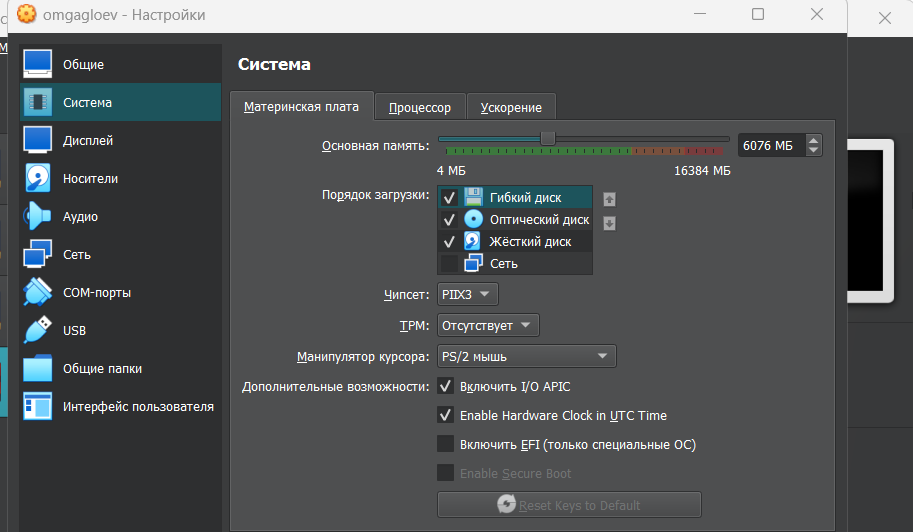
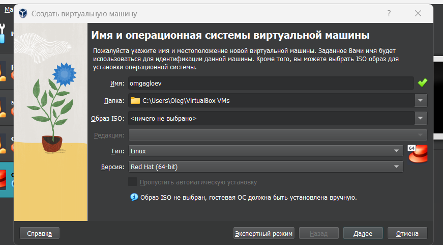
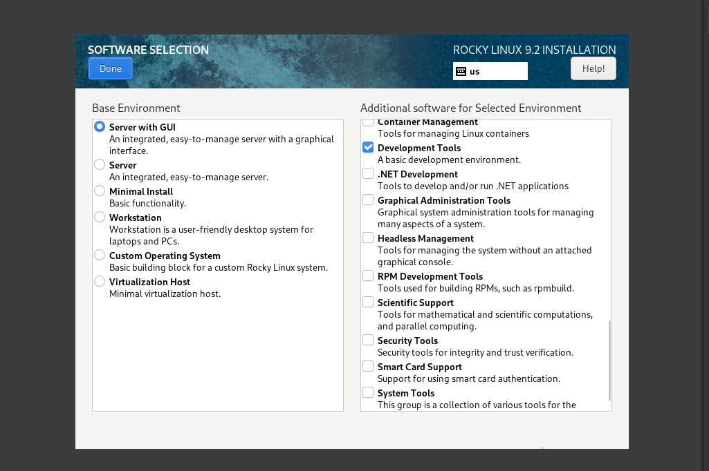
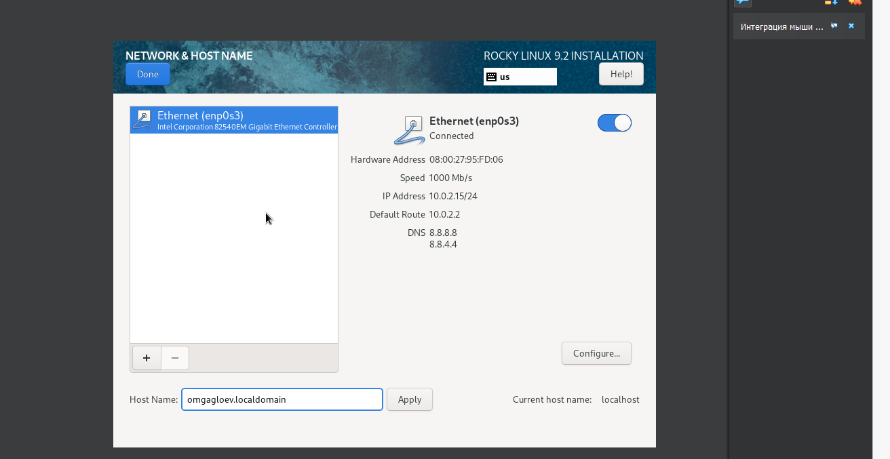
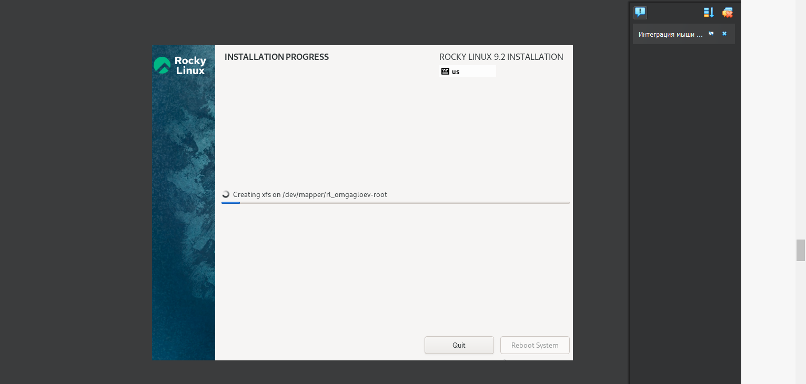
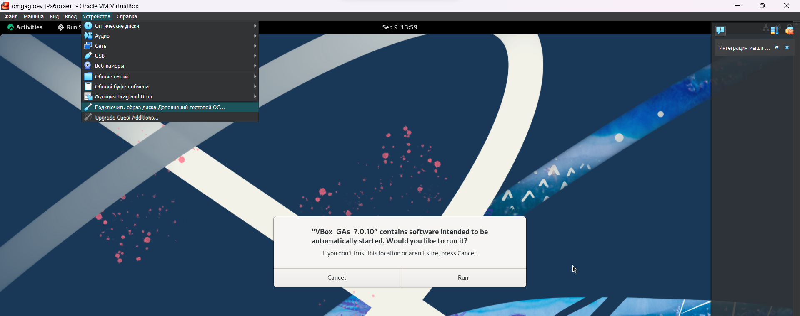
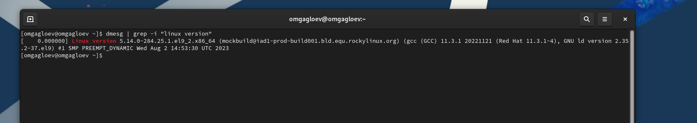
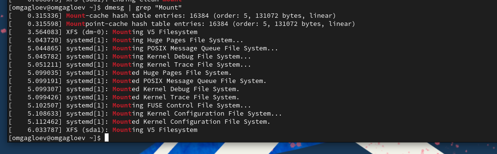

---
## Front matter
lang: ru-RU
title: Установка ОС на виртуальную машину
author: |
	 \inst{1}

institute: |
	\inst{1}Российский Университет Дружбы Народов

date: 9 сентября, 2023, Москва, Россия

## Formatting
mainfont: PT Serif
romanfont: PT Serif
sansfont: PT Sans
monofont: PT Mono
toc: false
slide_level: 2
theme: metropolis
header-includes:
 - \metroset{progressbar=frametitle,sectionpage=progressbar,numbering=fraction}
 - '\makeatletter'
 - '\beamer@ignorenonframefalse'
 - '\makeatother'
aspectratio: 43
section-titles: true

---

## Выполнил работу:
Гаглоев Олег НПИбд-01-20

# Цели и задачи работы

## Цель лабораторной работы

Целью данной работы является приобретение практических навыков установки операционной системы на виртуальную машину, настройки минимально необходимых для дальнейшей работы сервисов.

## Создаю виртуальную машину

## Создаю виртуальную машину

## Настройка системы

## Настройка системы

## Установка системы

## Первый запуск

# Задания:

## Версия ядра Linux (Linux version).

## Частота процессора (Detected Mhz processor).

## Модель процессора (CPU0).

## Объем доступной оперативной памяти (Memory available).

## Тип обнаруженного гипервизора (Hypervisor detected).

## Тип файловой системы корневого раздела.

## Последовательность монтирования файловых систем.

# Выводы по проделанной работе

## Вывод

Я приобрел практические навыки установки операционной системы на виртуальную машину, настройки минимально необходимых для дальнейшей работы сервисов.

