---
# Front matter
title: "Отчёт по лабораторной работе №5"
subtitle: "Дискреционное разграничение прав в Linux. Исследование влияния дополнительных атрибутов"
author: "Гаглоев Олег Мелорович"

# Generic otions
lang: ru-RU
toc-title: "Содержание"

# Bibliography
bibliography: bib/cite.bib
csl: pandoc/csl/gost-r-7-0-5-2008-numeric.csl

# Pdf output format
toc: true # Table of contents
toc_depth: 2
lof: true # List of figures
fontsize: 12pt
linestretch: 1.5
papersize: a4
documentclass: scrreprt
## I18n
polyglossia-lang:
  name: russian
  options:
	- spelling=modern
	- babelshorthands=true
polyglossia-otherlangs:
  name: english
### Fonts
mainfont: PT Serif
romanfont: PT Serif
sansfont: PT Sans
monofont: PT Mono
mainfontoptions: Ligatures=TeX
romanfontoptions: Ligatures=TeX
sansfontoptions: Ligatures=TeX,Scale=MatchLowercase
monofontoptions: Scale=MatchLowercase,Scale=0.9
## Biblatex
biblatex: true
biblio-style: "gost-numeric"
biblatexoptions:
  - parentracker=true
  - backend=biber
  - hyperref=auto
  - language=auto
  - autolang=other*
  - citestyle=gost-numeric
## Misc options
indent: true
header-includes:
  - \linepenalty=10 # the penalty added to the badness of each line within a paragraph (no associated penalty node) Increasing the value makes tex try to have fewer lines in the paragraph.
  - \interlinepenalty=0 # value of the penalty (node) added after each line of a paragraph.
  - \hyphenpenalty=50 # the penalty for line breaking at an automatically inserted hyphen
  - \exhyphenpenalty=50 # the penalty for line breaking at an explicit hyphen
  - \binoppenalty=700 # the penalty for breaking a line at a binary operator
  - \relpenalty=500 # the penalty for breaking a line at a relation
  - \clubpenalty=150 # extra penalty for breaking after first line of a paragraph
  - \widowpenalty=150 # extra penalty for breaking before last line of a paragraph
  - \displaywidowpenalty=50 # extra penalty for breaking before last line before a display math
  - \brokenpenalty=100 # extra penalty for page breaking after a hyphenated line
  - \predisplaypenalty=10000 # penalty for breaking before a display
  - \postdisplaypenalty=0 # penalty for breaking after a display
  - \floatingpenalty = 20000 # penalty for splitting an insertion (can only be split footnote in standard LaTeX)
  - \raggedbottom # or \flushbottom
  - \usepackage{float} # keep figures where there are in the text
  - \floatplacement{figure}{H} # keep figures where there are in the text
---

# Цель работы

Изучение механизмов изменения идентификаторов, применения SetUID и Sticky-битов. Получение практических навыков работы в консоли с дополнительными атрибутами. Рассмотрение работы механизма смены идентификатора процессов пользователей, а также влияние бита Sticky на запись и удаление файлов.

# Выполнение лабораторной работы

## Подготовка

1.	Для выполнения части заданий требуются средства разработки приложений. Проверили наличие установленного компилятора gcc командой gcc -v:  компилятор обнаружен.


2.	Чтобы система защиты SELinux не мешала выполнению заданий работы, отключили систему запретов до очередной перезагрузки системы командой setenforce 0:

3.	Команда getenforce вывела Permissive:

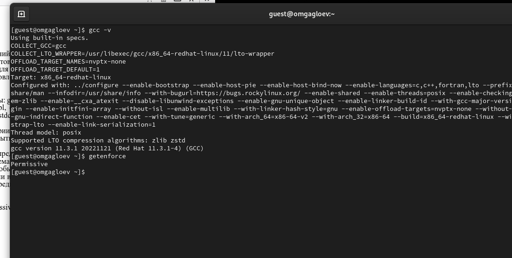{ #fig:001 width=70% height=70%}

## Изучение механики SetUID

1.	Вошли в систему от имени пользователя guest.

2.	Написали программу simpleid.c.

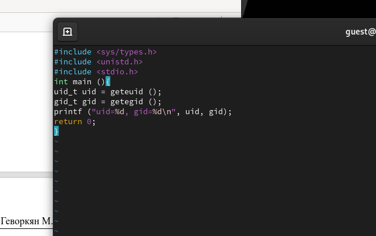{ #fig:002 width=70% height=70%}

3.	Скомпилировали программу и убедились, что файл программы создан: gcc simpleid.c -o simpleid

4.	Выполнили программу simpleid командой ./simpleid

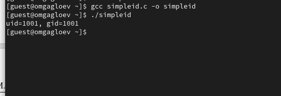{ #fig:003 width=70% height=70%}


5.	Выполнили системную программу id с помощью команды id. uid и gid совпадает в обеих программах


6.	Усложнили программу, добавив вывод действительных идентификаторов.

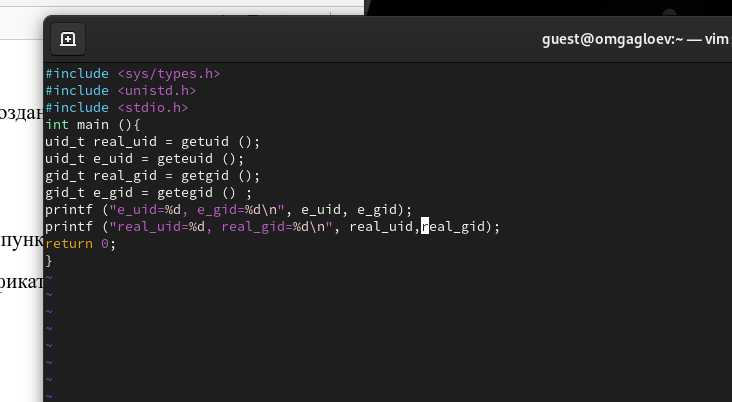{ #fig:005 width=70% height=70%}

7.	Скомпилировали и запустили simpleid2.c:

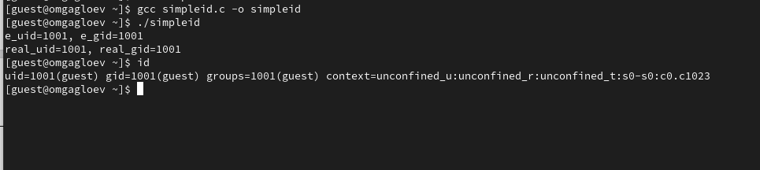{ #fig:006 width=70% height=70%}


8.	От имени суперпользователя выполнили команды:

```
chown root:guest /home/guest/simpleid2
chmod u+s /home/guest/simpleid2
```


9.	Использовали su для повышения прав до суперпользователя

10.	Выполнили проверку правильности установки новых атрибутов и смены владельца файла simpleid2:

```
ls -l simpleid2
```

11.	Запустили simpleid2 и id:

Результат выполнения программ теперь немного отличается

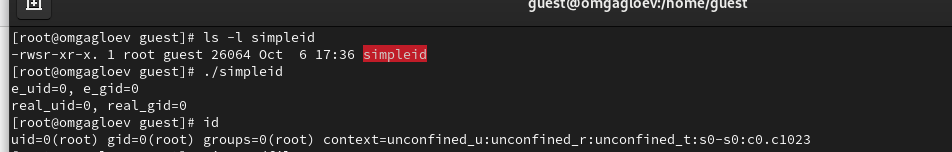{ #fig:007 width=70% height=70%}


12.	Проделали тоже самое относительно SetGID-бита.

13.	Написали программу readfile.c

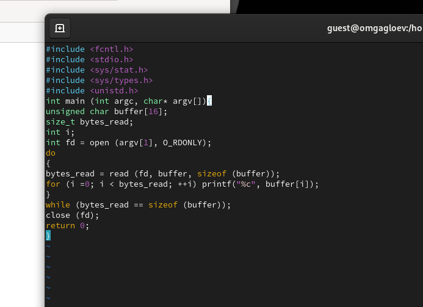{ #fig:008 width=70% height=70%}

14.  Откомпилировали её.

```
gcc readfile.c -o readfile
```

15. Сменили владельца у файла readfile.c и изменили права так, чтобы только суперпользователь (root) мог прочитать его, a guest не мог.

```
chown root:guest /home/guest/readfile.c
chmod 700 /home/guest/readfile.c
```

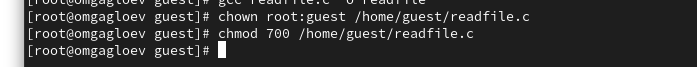{ #fig:009 width=70% height=70%}

16. Проверили, что пользователь guest не может прочитать файл readfile.c.
    
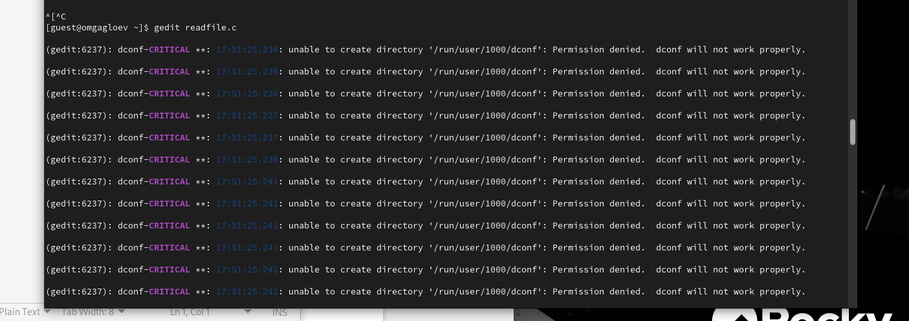{ #fig:010 width=70% height=70%}


17.  Сменили у программы readfile владельца и установили SetU’D-бит.


2.  Проверили, может ли программа readfile прочитать файл readfile.c

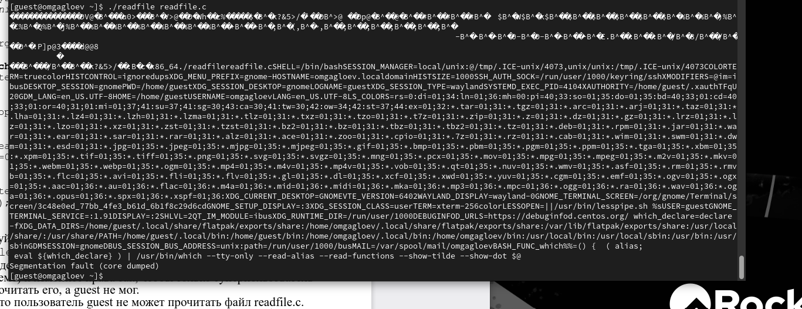{ #fig:011 width=70% height=70%}

3.  Проверили, может ли программа readfile прочитать файл /etc/shadow

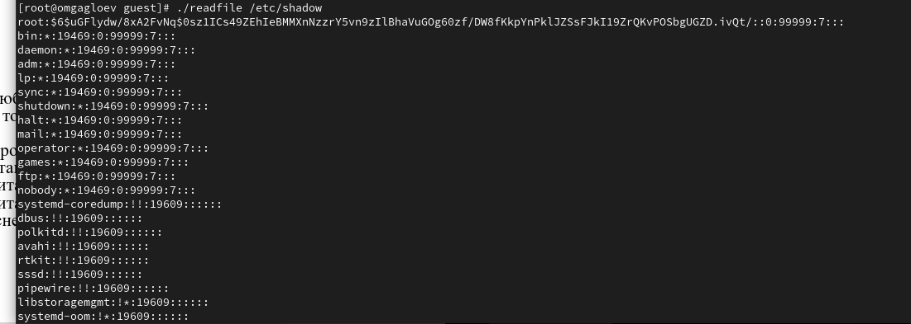{ #fig:012 width=70% height=70%}

## Исследование Sticky-бита

1.	Выяснили, установлен ли атрибут Sticky на директории /tmp:

```
ls -l / | grep tmp
```

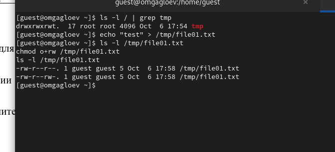{ #fig:013 width=70% height=70%}

2.	От имени пользователя guest создали файл file01.txt в директории /tmp со словом test:

```
echo "test" > /tmp/file01.txt
```

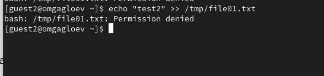{ #fig:014 width=70% height=70%}

3.	Просмотрели атрибуты у только что созданного файла и разрешили чтение и запись для категории пользователей «все остальные»:

```
ls -l /tmp/file01.txt
chmod o+rw /tmp/file01.txt
ls -l /tmp/file01.txt
```

Первоначально все группы имели право на чтение, а запись могли осуществлять все, кроме «остальных пользователей».

4.	От пользователя (не являющегося владельцем) попробовали прочитать файл /file01.txt:

```
cat /file01.txt
```

5.	От пользователя попробовали дозаписать в файл /file01.txt слово test3 командой:

```
echo "test2" >> /file01.txt
```

6.	Проверили содержимое файла командой:

```
cat /file01.txt
```

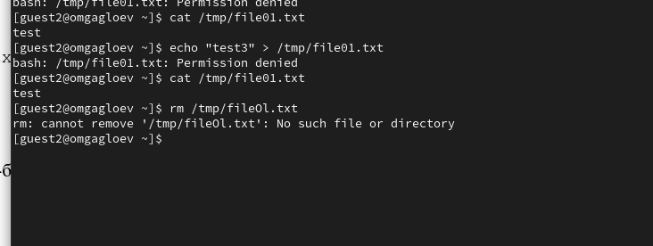{ #fig:014 width=70% height=70%}


7.	От пользователя попробовали записать в файл /tmp/file01.txt слово test4, стерев при этом всю имеющуюся в файле информацию командой. Для этого воспользовалась командой echo "test3" > /tmp/file01.txt

8.	Проверили содержимое файла командой

```
cat /tmp/file01.txt
```

9.	От пользователя попробовали удалить файл /tmp/file01.txt командой rm /tmp/file01.txt, однако получила отказ.

10.	От суперпользователя командой выполнили команду, снимающую атрибут t (Sticky-бит) с директории /tmp:

```
chmod -t /tmp
```

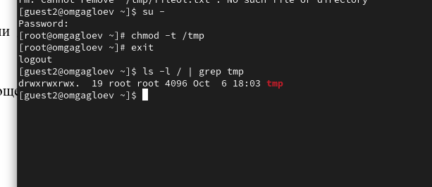{ #fig:015 width=70% height=70%}
Покинули режим суперпользователя командой exit.

11.	От пользователя  проверили, что атрибута t у директории /tmp нет:

```
ls -l / | grep tmp
```

12.	Повторили предыдущие шаги. Получилось удалить файл

13.	Удалось удалить файл от имени пользователя, не являющегося его владельцем.

14.	Повысили свои права до суперпользователя и вернули атрибут t на директорию /tmp :

```
su
chmod +t /tmp
exit
```

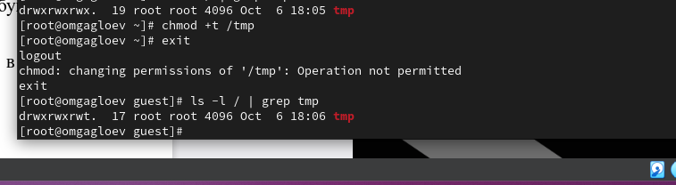{ #fig:016 width=70% height=70%}


# Выводы

Изучили механизмы изменения идентификаторов, применения SetUID- и Sticky-битов. Получили практические навыки работы в консоли с дополнительными атрибутами. Также мы рассмотрели работу механизма смены идентификатора процессов пользователей и влияние бита Sticky на запись и удаление файлов.

# Список литературы {.unnumbered}

1. [КОМАНДА CHATTR В LINUX](https://losst.ru/neizmenyaemye-fajly-v-linux)
2. [chattr](https://en.wikipedia.org/wiki/Chattr)
