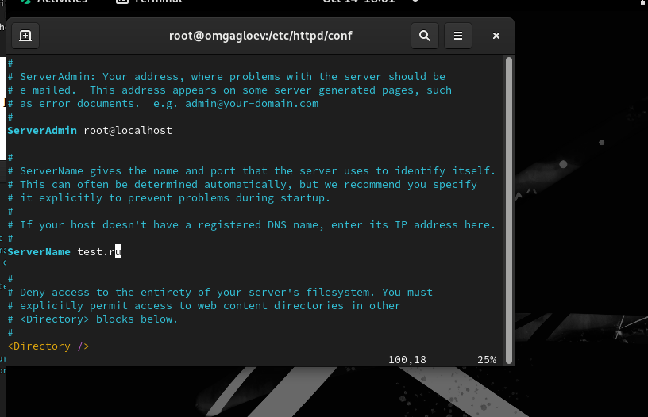
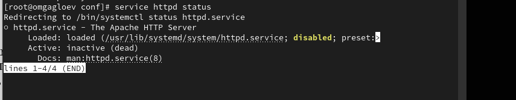
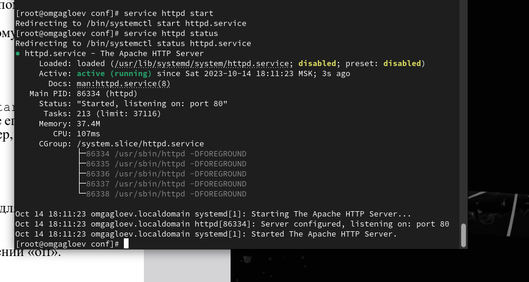
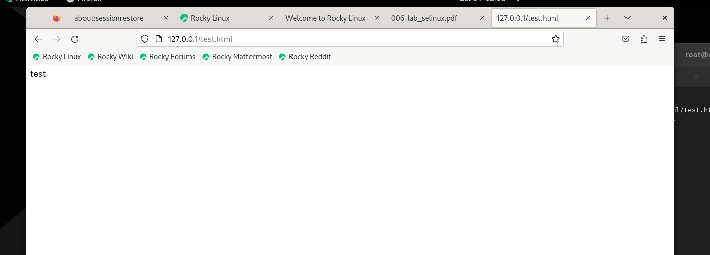
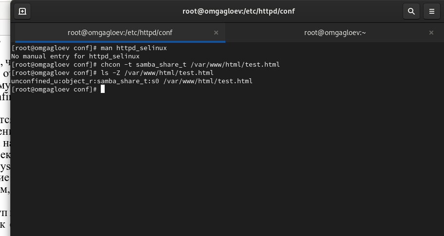
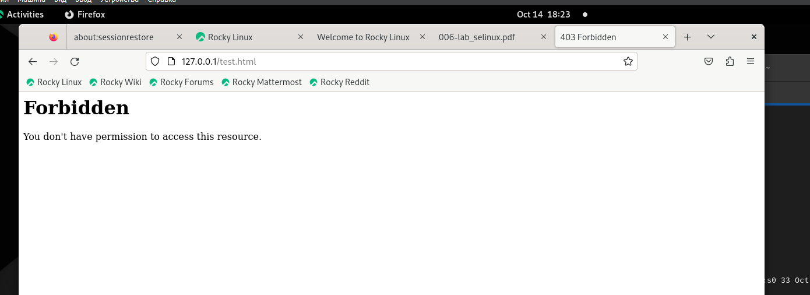

---
## Front matter
lang: ru-RU
title: Мандатное разграничение прав в Linux
author: Гаглоев Олег Мелорович
institute: Российский Университет Дружбы Народов
date: 14 октября, 2023, Москва, Россия

## Formatting
mainfont: PT Serif
romanfont: PT Serif
sansfont: PT Sans
monofont: PT Mono
toc: false
slide_level: 2
theme: metropolis
header-includes:
 - \metroset{progressbar=frametitle,sectionpage=progressbar,numbering=fraction}
 - '\makeatletter'
 - '\beamer@ignorenonframefalse'
 - '\makeatother'
aspectratio: 43
section-titles: true

---

# Цели и задачи

## Теоретическое введение

Apache – это свободное программное обеспечение для размещения веб-сервера. Он хорошо показывает себя в работе с масштабными проектами, поэтому заслуженно считается одним из самых популярных веб-серверов. Кроме того, Apache очень гибок в плане настройки, что даёт возможность реализовать все особенности размещаемого веб-ресурса.

## Цель лабораторной работы

Развить навыки администрирования ОС Linux. Получить первое практическое знакомство с технологией SELinux. Проверить работу SELinx на практике совместно с веб-сервером Apache

# Выполнение лабораторной работы
  
## Установка нужных параметров

{ #fig:001 width=70% height=70%}

## Запуск HTTP-сервера

{ #fig:002 width=70% height=70%}

## Запуск HTTP-сервера

{ #fig:003 width=70% height=70%}

## Создание HTML-файла

{ #fig:004 width=70% height=70%}

## Изменение контекста безопасности

{ #fig:005 width=70% height=50%}

{ #fig:006 width=500% height=70%}

## Переключение порта и восстановление контекста безопасности

{ #fig:007 width=70% height=70%}

# Выводы

## Результаты выполнения лабораторной работы

В процессе выполнения лабораторной работы мною были получены базовые навыки работы с технологией seLinux.
